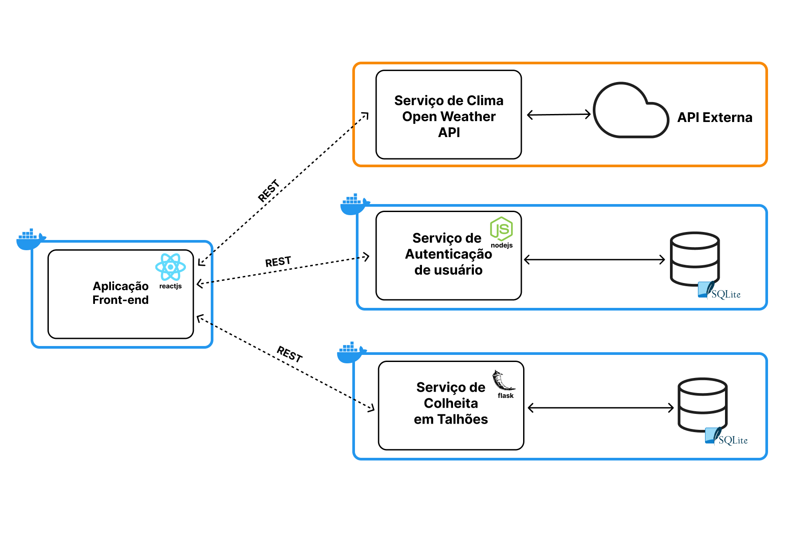

    

# Agriprecision - App Front-end

Recursos precisos para um plantio sustentável e eficiente.

**Agriprecision** tem como objetivo contribuir na agricultura de precisão, definindo os requisitos das safras e do solo para uma produtividade ótima, por um lado, e para preservar os recursos, assegurar a sustentabilidade ambiental e a proteção, por outro. Assim, contribuindo para [os Objetivos de Desenvolvimento Sustentável do documento da ONU](https://brasil.un.org/pt-br/sdgs).

Portanto, trata-se de um Web App que permite aos agricultores controlarem a quantidade de insumos agrícolas aplicáveis dentro de áreas agrícolas definidas na fase de plantio.

Projeto desenvolvido para o MVP na Sprint Arquitetura de Software da Pós Graduação de Engenharia de Software da PUC-Rio.

## Arquitetura de Software Desenvolvida

O projeto foi desenvolvido em uma arquitetura baseada em microsserviços que possui como serviços de APIs externas a autenticação e de dados do clima, assim como foram desenvolvidos os serviços de gerenciamento de estoque de insumos agrícolas disponíveis e o gerenciamento do histórico de produção com base nas colheitas em talhões.

### Acesso aos componentes da Arquitetura

- **Aplicação Front-end (Repositório Atual)**
- [Serviço de insumos agrícolas]()
- [Serviço de Colheitas em Talhões]()
-  [Serviço de Autenticação do Firebase]()
-  [Serviço de Clima de Open Weather API]()

## Como executar a aplicação com Docker

## Como executar a aplicação sem Docker