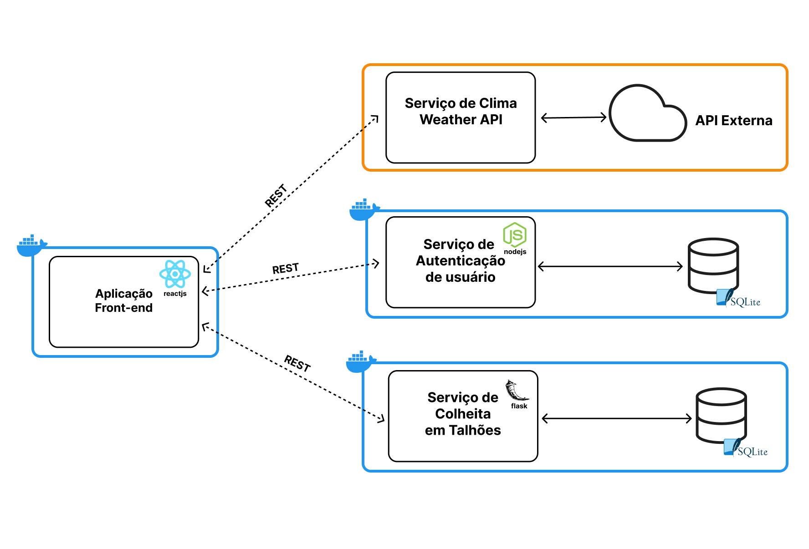

<p align="center" style="margin: 40px 0">
    
</p>

<div align="center">


</div>

# Agriprecision - Aplicação Front-end

Seu plantio sustentável e eficiente.

**Agriprecision** tem como objetivo contribuir para a agricultura de precisão, definindo os requisitos das safras e do solo para se obter uma produtividade eficiente, com a preservação de recursos e assegurar a sustentabilidade ambiental. Assim, contribuindo para [o documento da ONU dos Objetivos de Desenvolvimento Sustentável](https://brasil.un.org/pt-br/sdgs).

Projeto desenvolvido para o MVP na Sprint: **Arquitetura de Software** da Pós Graduação de Engenharia de Software da PUC-Rio.


## Arquitetura de Software Desenvolvida

O projeto foi desenvolvido em uma arquitetura baseada em microsserviços, na qual uma aplicação front-end monolítica gerencia todo o estado e o comportamento, enquanto utiliza microsserviços de apoio para recuperar dados ou executar as operações necessárias. Os microsserviços utilizados são: Serviço de autenticação, Serviço de dados do clima e Serviço de colheitas em talhões, que podem ser observados melhor no diagrama a seguir.




### Acesso aos componentes da Arquitetura

- **Aplicação Front-end (Repositório Atual)**
- [Serviço de Colheitas em Talhões](https://github.com/MicaelRiboura/agriPrecisionHarvestService)
-  [Serviço de Autenticação de Usuário](https://github.com/MicaelRiboura/agriPrecisionUserService)
-  [Serviço de Clima de Weather API](./weather-api.docs.md)

## Como executar a aplicação com Docker

### 1 - Clonando o repositório
Antes de tudo, precisamos clonar o projeto para ser executado em sua máquina. Você pode clonar esse repositório fazendo o download por meio de um arquivo ZIP ou através do seguinte comando:

```
git clone https://github.com/MicaelRiboura/agriprecisionWebApp.git
```

> ⚠️ Após clonar o repositório, é necessário ir ao diretório raiz do projeto, pelo terminal, para poder executar os comandos descritos abaixo.

### 2 - Criando arquivo *.env*

O próximo passo é criar o arquivo com as configurações de ambiente. Para isso, crie um arquivo com o nome `.env` e preencha-o com as chaves presentes abaixo e os valores corretos:

```
VITE_WEATHER_API_URL=
VITE_WEATHER_API_KEY=
VITE_HARVEST_API_URL=
VITE_USER_API_URL=
```

> ⚠️ Atenção! Esse exemplo possui apenas as chaves sem valores. Para conseguir executar a aplicação sem nenhum problema, é necessário que preencha manualmente os valores, como os endereços dos microsserviços executando em sua máquina e sua chave de OpenWeather API que pode ser adquirida em https://www.weatherapi.com/docs/.

### 3 - Criando a imagem Docker
Primeiro, você deve criar uma imagem Docker com o seguinte comando:

```
docker build -t agri-frontend .
```

### 4 - Rodando container Docker
Para executar um container Docker com base na imagem criada através do seguinte comando:

```
docker run -p 3000:3000 agri-frontend
```

Ao final, cole esse endereço no seu navegador para visualizar a documentação da API e suas rotas:

```
localhost:3000
```

## Como executar a aplicação sem Docker

## 1 - Clonando o repositório
Antes de tudo, precisamos clonar o projeto para ser executado em sua máquina. Você pode clonar esse repositório fazendo o download por meio de um arquivo ZIP ou através do seguinte comando:

```
git clone https://github.com/MicaelRiboura/agriprecisionWebApp.git
```

> ⚠️ Após clonar o repositório, é necessário ir ao diretório raiz do projeto, pelo terminal, para poder executar os comandos descritos abaixo.

### 2 - Criando arquivo *.env*

O próximo passo é criar o arquivo com as configurações de ambiente. Para isso, crie um arquivo com o nome `.env` e preencha-o com as chaves presentes abaixo e os valores corretos:

```
VITE_WEATHER_API_URL=
VITE_WEATHER_API_KEY=
VITE_HARVEST_API_URL=
VITE_USER_API_URL=
```

> ⚠️ Atenção! Esse exemplo possui apenas as chaves sem valores. Para conseguir executar a aplicação sem nenhum problema, é necessário que preencha manualmente os valores, como os endereços dos microsserviços executando em sua máquina e sua chave de OpenWeather API que pode ser adquirida em https://www.weatherapi.com/docs/.

#

Para executar a aplicação é necessário ter todas as libs (bibliotecas) javascript listadas no arquivo `package.json` instaladas.

#

### 3 - Instalando as dependências

Para instalar as libs listadas no arquivo `package.json`, execute o comando abaixo:

```
npm install
```
### 4 - Executando a Aplicação Front-end
Para executar a API, basta executar o seguinte comando:

```
npm run dev
```

Ao final, cole esse endereço no seu navegador para visualizar a documentação da API e suas rotas:

```
localhost:3000
```
